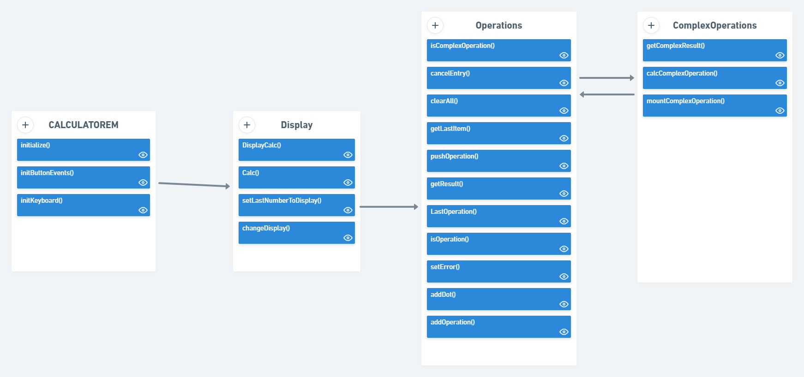

# UFERSA-Calc
Calculadora desenvolvida na disciplina de Estrutura de Dados I da UFERSA.
  
<h2>Contextualização do domínio</h2>
 

A UFERSA-Calc é uma calculadora desenvolvida aplicando-se conceitos ensinados na disciplina de Estrutura de Dados I da Universidade Federal Rural do Semi-Árido. Tem como funcionalidades, além das funções básicas de uma calculadora, o cálculo de algumas das funções mais conhecidas por alunos do ensino médio, ajudando esses alunos a corrigirem suas atividades com mais facilidade. A UFERSA-Calc tem como inspiração o Symbolab, um solucionador matemático disponível na web.

  
<h2>Objetivos</h2>
 
<ul>
  <li>A UFERSA-Calc visa ser um aplicativo simples e de fácil uso para alunos do ensino médio, portando apenas as funcionalidades que são adequadas para os estudantes que se encontram nesse nível de ensino. </li>
  <li>Ser uma ferramenta que facilite a correção de atividades por parte dos alunos do ensino médio.</li>
  <li>Auxiliar os alunos na assimilação de algumas regras mais utilizada na matemática do ensino medio</li>
 </ul>
   
 <h2>Descrição de funcionalidade funcionalidade e recursos </h2>
  <li>Realizar calculos simples</li>
  <li>Mudar o formato da calculadora ao selecionar o botão de cálculo de funções</li>
  <li>Em situação de um cálculo de funções, mostrar parte do processo no display/tela</li>
  <li>Realizar cáculos de funções:</li>
  <ul>
    <li>Afins</li>
    <li>Quadráticas</li>
    <li>Logarítimicas</li>
  </ul>
  <li>Funcionar por meio dos botões em tela</li>
    
 <h2>Classes-entidade e seus atributos</h2>
 
 <h2>Arquitetura</h2>
  <li>Model-view-controller (MVC)</li>
    
 <h2>Wireframe - FIGMA</h2>
 
 
 
  
